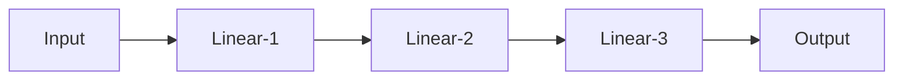
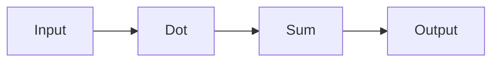
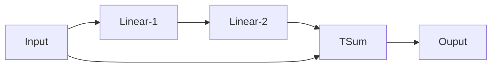

# UMD

UMD (which stand for Unified Model Definition) is a project that aim to give a language agnostic definition for Neural Network (MLP, CNN, GNN, ...). The format should be modulable (i.e. you must be capable of sharing it to someone and he must be able to use it in another model).
With format will come (hopefully) multiple functionallities, like _initial loss prediction_, _network parameter flexibility_, ...

For the moment those _concept_ are just intuition base but if you have any suggestion for paper, ect..  feel free to open an issue.

## Roadmap

### Step 1 : Let it be solve

The first step for the moment is to implement the network solver. For this I use [haskell](https://www.haskell.org), for it's strict and expressive typing, the syntax and because I wanted to learn it in a project.

Now, deep in the representation. For a start, I want to express neural network as [DAG](https://en.wikipedia.org/wiki/Directed_acyclic_graph) where each node of the graph represent an [`Op`](src/Op.hs), for example a dot product between an input tensor and a weight tensor. An `Op` can, of course, be a neural network, for example a [`ResNet`](app/ResNet.hs) layer. At the end, we should have something like this:


for a simple MLP where `Linear` layer are themselve neural network like

Where the `Dot` is the dot operation between the input and a weight tensor and `Sum` is the sum between the input and a bias tensor.

For the moment the graph is simple to express, but the tricky part come when you have things like the `ResNet` layer


Where `TSum` is the element sum of two tensor of same shape (not excatly, technicaly you can sum two tensor if the shape $A + B$ if the shape of $B$ is _compatible_ with the shape of $A$. The notion of compatible is still not completely mathemacally fully defined for me).

For the moment, the tensor dimensions are correctly propagated through the DAG and it can "solve" simple neural netoworks

### Step 2 : Have you hear of convolution
The next step will be to ask for the distribution of the input value then propagate the shape evolution through the layers to determine what the untrained output shape will be like. By comparing this shape to the expected output shape you can give an estimation of the expected loss with the untrained network. For the moment (considering that the weight initially distributed following a known pdf) I think this should be possible through convolution.

### Step 3 : Shake that booty
Next thing to do is to slighlty change the pdf of the weights in the layers and observe the evolution of the output shape. This give a _flexibility_ coeficient that should be correlated to the necessary learning rate to converge to the solution. This will also allow to verify that the expected output shape is allowed by the neural network.

### Step 4 : Format C:/

Once all of this is done, I should have a clear enough idea of what is needed in the format to express the neural networks. Considering I want this format to be able to be transpiled to c++ and python model, I will need to write a translator between this format and the different couple language/library

## How to build and run

To build this project simply run
```bash
cabal build
```

To run the project run
```bash
cabal run umd-exe
```

There is not test for the moment (and that's sad)
